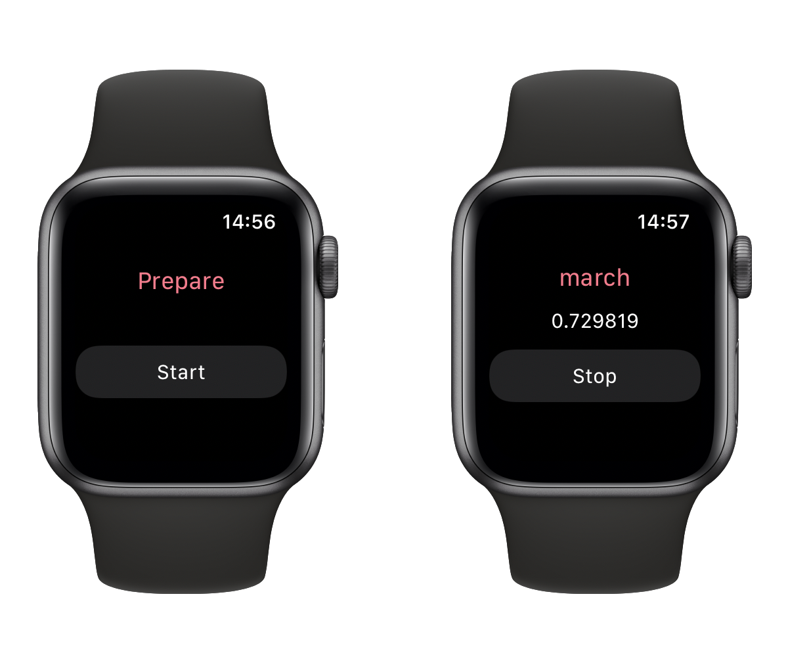
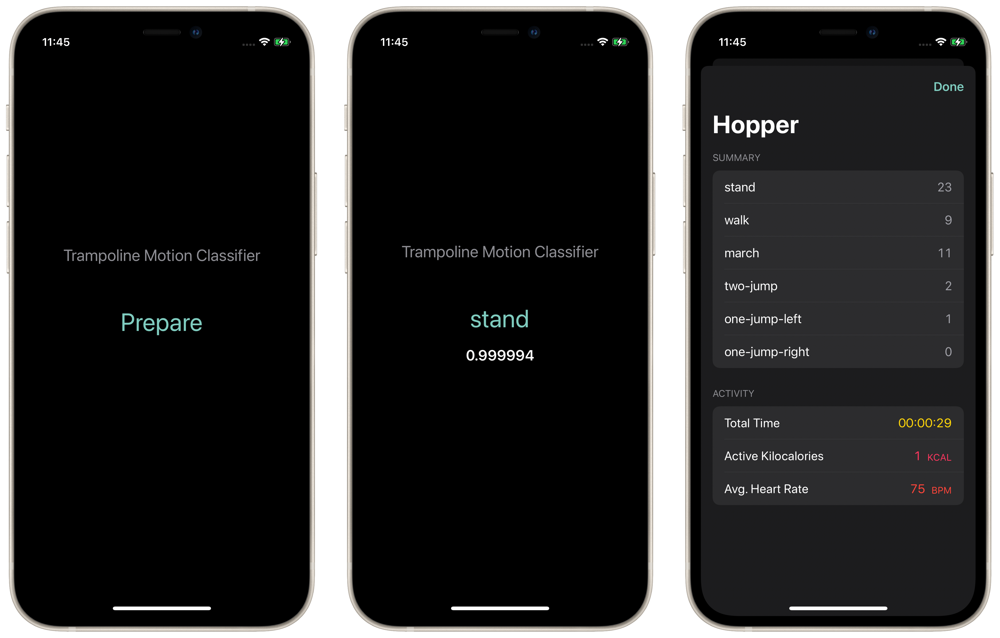

#  Hopper

Hopper can detect motion you perform on a trampoline by your Apple Watch!

Hopper uses accelerometer data and Core ML to detect the motion you perform on the trampoline.

  

  

## Requirements
- iOS 14.4+
- watchOS 7.2+
- Xcode 12.4+
